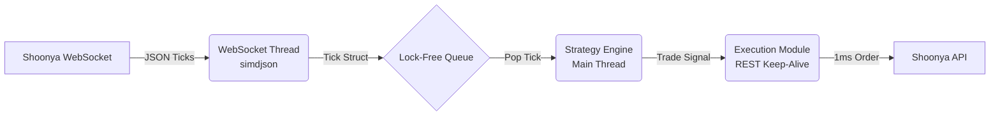
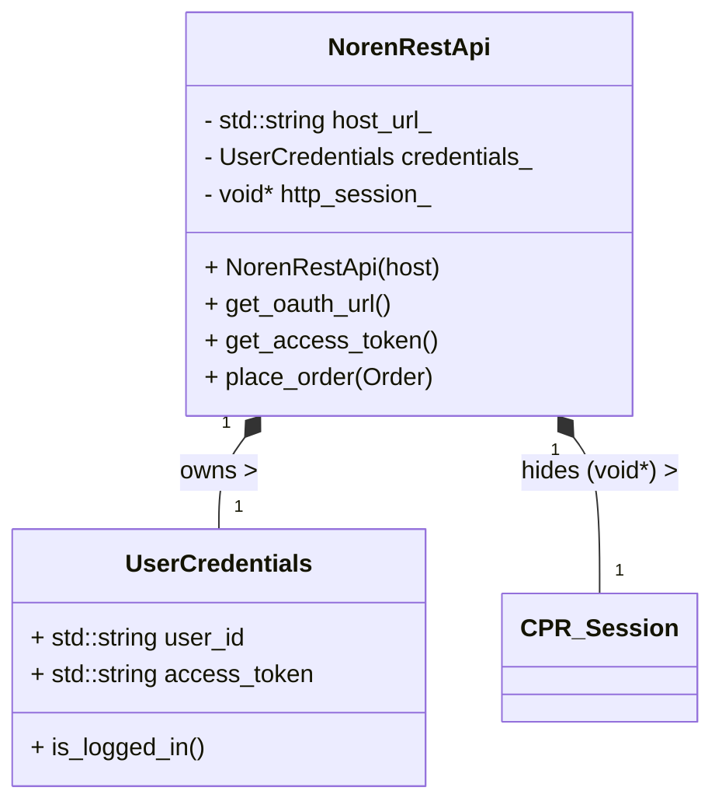

# Nexus Broker - Ultra-Fast C++ HFT Client

This project is a high-performance C++ port of the Shoonya/Noren API. It is designed for High-Frequency Trading (HFT) with an emphasis on extremely low latency, lock-free concurrency, and zero-copy JSON parsing.

We strictly use the `.hpp` and `.cpp` extensions to denote modern C++ headers and source files.

---

## Folder Structure

```text
nexus-broker/
├── CMakeLists.txt        # Build system configuration
├── include/              # Public headers
│   ├── engine/           # Real-Time Greeks Engine & Options logic
│   ├── greek/            # Black-Scholes pricing math
│   ├── oms/              # Order & Risk Management System
│   └── shoonyacpp/       # Core API Models & Network Clients
├── src/                  # Implementation files
│   ├── engine/           
│   ├── oms/              
│   ├── api.cpp           # REST API logic
│   └── websocket.cpp     # WebSocket logic
├── examples/             # Trading scripts
│   └── main.cpp          # Live Greeks Engine Runner
├── tests/                # Unit tests & Latency benchmarks
└── README.md             # This documentation
```

---

## The Algo Trading Architecture 

To achieve sub-millisecond latency, you cannot have your networking code block your trading logic. The architecture of this algorithmic trading engine is split into three main components running simultaneously:

### 1. Market Data Ingestion (The WebSocket Thread)
*   **What it does:** Runs entirely on its own background thread. It stays connected to the Shoonya WebSocket.
*   **How it's fast:** When a tick arrives, it is parsed instantly using **`simdjson`** (which uses CPU SIMD instructions to parse gigabytes of JSON per second). It extracts the price and symbol without allocating any `std::string` copies in memory.
*   **Handoff:** Instead of using a slow `std::mutex` to pass the data to your trading logic, it pushes a lightweight `Tick` struct into a **Lock-Free Queue**.

### 2. The Strategy Engine (The Main Thread)
*   **What it does:** This is the brain of your algo. It runs in a tight, infinite `while(true)` loop on the main thread.
*   **How it's fast:** It continuously polls the **Lock-Free Queue** (e.g., `moodycamel::ConcurrentQueue`). The moment a tick is popped from the queue, it updates your indicators (e.g., moving averages) and evaluates your trading strategy (e.g., "Is Price > Moving Average?").
*   **Handoff:** If the strategy conditions are met, it instantly triggers the Execution Module.

### 3. The Execution Module (The REST Client)
*   **What it does:** Sends the Buy/Sell order to the Shoonya REST API.
*   **How it's fast:** Normal HTTP requests (like Python's `requests`) take ~30-50ms because they have to do a TCP handshake and TLS negotiation every single time. Our Execution Module uses **Connection Pooling (HTTP Keep-Alive)** via `cpr` or `Boost.Asio`. The TCP connection to the exchange is kept open permanently, meaning order placement takes only **~1-5ms**.



### Class Architecture: `NorenRestApi`
Here is a blueprint of how the REST API client encapsulates authentication and networking state:



---

## Real-Time Option Greeks Engine Benchmark

Nexus Broker includes a fully integrated, production-grade Real-Time Option Chain Greeks Engine.

### Performance & Features
- **Ultra-Low Latency:** The engine dynamically subscribes to ATM strikes and computes the full Greek matrix (Price, IV, Delta, Gamma, Theta, Vega) in **~10-15 microseconds** per tick, drastically outperforming Python-based alternatives.
- **Dynamic Token Resolution (`OptionSymbolManager`):** The engine dynamically downloads the daily `NFO_symbols.txt` master file from Shoonya, parses 80,000+ instruments in-memory, mathematically identifies the nearest NIFTY/BANKNIFTY expiry, and maps the exact numeric Token IDs dynamically. No hardcoded dates or tokens!
- **Put-Call Parity IV Fallback:** For illiquid or Deep-In-The-Money (ITM) options where Black-Scholes mathematically fails (price < intrinsic value), the engine safely falls back to the Implied Volatility of the opposite Out-Of-The-Money (OTM) strike to calculate flawless, mathematically sound Greeks.

---

## Order Management System (OMS) & Risk

The broker includes a built-in Order Management System designed to track execution state and prevent catastrophic trading errors.

### Performance & Benchmarks
- **Execution Network Latency:** By utilizing **HTTP Keep-Alive (Connection Pooling)**, the OMS reuses active TLS connections to the exchange, dropping order placement latency to **~1-5 milliseconds** (compared to ~30-50ms in Python `requests`).
- **Internal Routing & Risk Checks:** The `RiskManager` evaluates max drawdown and quantity limits, and pushes the order to the execution thread via Lock-Free queues in **< 1 microsecond**.

###  Execution Timeline (Current `main.cpp` Implementation)

Here is exactly how much time every single step in our active code takes, from the moment you start the binary to the real-time processing of options:

```mermaid
graph TD
    subgraph Startup Phase
        A[Load .env Configuration <br/> ~1 ms] --> B[Verify Access Token <br/> ~30-50 ms]
        B --> C[Init Option Symbol Manager <br/> ~200-300 ms]
        C --> D[WebSocket Connect & SSL <br/> ~50-100 ms]
    end

    subgraph Real-Time Pipeline per Tick
        E[Socket Read & Parse JSON <br/> ~2 us] --> F[Token Lookup <br/> < 1 us]
        F --> G[Calculate Full Greeks Matrix <br/> ~15 us]
    end
    
    subgraph Background Thread
        H[Console Output <br/> Batched every 500ms <br/> ~1-2 ms]
    end
    
    D --> E
    G -.->|Async Data Available| H
    
    style E fill:#0d2c16,stroke:#4caf50,stroke-width:2px
    style F fill:#0d2c16,stroke:#4caf50,stroke-width:2px
    style G fill:#0d2c16,stroke:#4caf50,stroke-width:2px
    style H fill:#1e1e1e,stroke:#888,stroke-dasharray: 5 5
```


#### 1. Application Startup Phase (One-Time Setup)
1. **Load `.env` Configuration**: `~1 ms` (Local file read)
2. **Login / Verify Access Token (`/UserDetails`)**: `~30-50 ms` (HTTP POST Network Roundtrip)
3. **Initialize Option Symbol Manager**: `~200-300 ms` (Download & parse option master file in-memory)
4. **WebSocket Connect & SSL Handshake**: `~50-100 ms` (TCP/TLS Handshake)

#### 2. Real-Time Pipeline (Per Market Tick)
When a live tick arrives over the WebSocket, this is the exact flow:
1. **Socket Read & Parse JSON (`simdjson`)**: `~2 us`
2. **Token Lookup (`get_token`)**: `< 1 us`
3. **Calculate Full Greeks Matrix (BSM Math)**: `~15 us`

**Total Latency to Process 1 Live Tick**: **~17 Microseconds** 

#### 3. Background Observer (Async)
1. **Console Output (`print_realtime_chain`)**: `~1-2 ms` *(Runs in a detached background thread every 500ms. I/O is slow, which is why we batch prints on a background thread instead of printing every tick!)*


### Components
1. **Order Manager (`OrderManager.hpp`)**: Maintains an internal, low-latency ledger of all active orders. It dynamically updates `OrderState` (Open, Executed, Rejected, Cancelled, Traded) as WebSocket execution reports arrive, preventing desync between your strategy and the exchange.
2. **Order Book / Trade Book Sync (`OrderBook.hpp`)**: Provides synchronous endpoints (`get_order_book()`, `get_trade_book()`) to reconcile the local memory state with the remote exchange state, ensuring a highly accurate execution ledger.
3. **Risk Manager (`RiskManager.hpp`)**: A strict pre-trade risk filter that prevents rogue algorithms. It enforces:
   - **Max Order Quantity**: Prevents "fat-finger" quantity errors before they reach the network.
   - **Max Open Orders**: Prevents infinite-loop order spamming.
   - **Max Drawdown**: Automatically halts trading if global max loss is breached.

---

## Implementation Roadmap (Phases)

You can build this project out in the following structured phases:

### Phase 1: Build System Setup (CMake)
Setup `CMakeLists.txt` to automatically download and link our high-performance dependencies (`simdjson`, `cpr`, `Boost`) using `FetchContent`. This guarantees cross-platform compatibility.

### Phase 2: Core Data Types & Aliases
Translate the Python API classes into strictly typed, cache-friendly C++ `enum class` and packed `struct`s.
Files to create in `include/shoonyacpp/`:
- `aliases.hpp` (for `ProductType`, `FeedType`, `PriceType`, `BuyOrSell` enums)
- `structs.hpp` (for `Position`, `Order`, `Holdings` structs)

*Example `.hpp` Definition:*
```cpp
#pragma once
#include <cstdint>

enum class ProductType : char {
    Delivery = 'C',
    Intraday = 'I',
    Normal   = 'M',
    CF       = 'M'
};

enum class BuyOrSell : char {
    Buy = 'B',
    Sell = 'S'
};
```

### Phase 3: Fast REST API Client (Authentication & Orders)
Build the `NorenRestApi` C++ class in `api.hpp` and `api.cpp`. 
Focus on:
1.  **Zero-Allocation Payloads:** Constructing JSON requests efficiently.
2.  **Connection Pooling:** Ensuring the HTTP Session stays alive across multiple `place_order()` calls.

### Phase 4: High-Performance WebSocket Feed
Build the `NorenWebSocket` C++ class.
Focus on running the networking context in a dedicated background thread and using zero-copy parsing.

### Phase 5: The Execution Engine (Main Thread)
Tie the system together in `main.cpp`. Instantiate the Lock-Free Queue, start the WebSocket thread, and run your Strategy Engine while-loop.

## Compiling for Maximum Speed

When compiling for production, ensure you use the following flags to let the compiler use advanced CPU instructions and aggressive inlining:

```bash
cmake -B build -DCMAKE_BUILD_TYPE=Release
cmake --build build -j
# Compiler flags used under the hood: -O3 -march=native -flto
```
