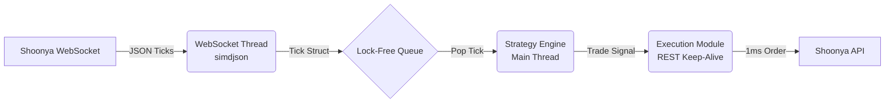
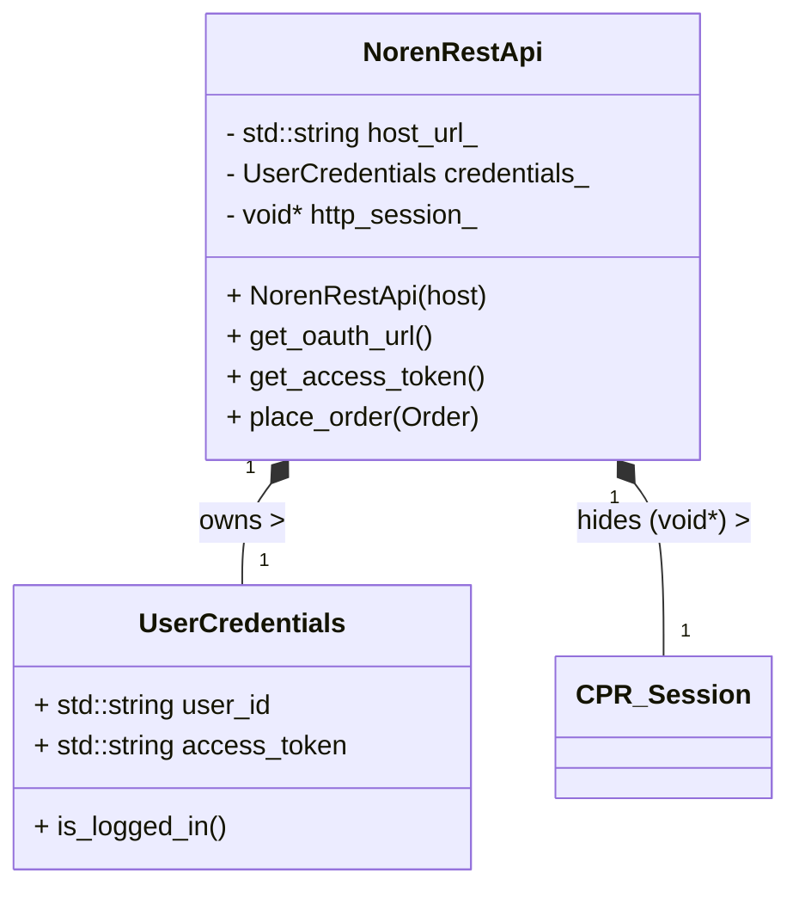

# Nexus Broker - Ultra-Fast C++ HFT Client

This project is a high-performance C++ port of the Shoonya/Noren API. It is designed for High-Frequency Trading (HFT) with an emphasis on extremely low latency, lock-free concurrency, and zero-copy JSON parsing.

We strictly use the `.hpp` and `.cpp` extensions to denote modern C++ headers and source files.

---

## 📂 Folder Structure

```text
nexus-broker/
├── CMakeLists.txt        # Build system configuration
├── include/              # Public headers
│   └── shoonyacpp/
│       ├── aliases.hpp   # Enums (ProductType, FeedType, etc.)
│       ├── structs.hpp   # Data Transfer Objects (Position, Order)
│       ├── api.hpp       # REST API Client definitions
│       ├── websocket.hpp # WebSocket Client definitions
│       └── shoonya.hpp   # Main library header (includes everything)
├── src/                  # Implementation files
│   ├── api.cpp           # REST API logic
│   └── websocket.cpp     # WebSocket logic
├── examples/             # Trading scripts
│   └── main.cpp          # Execution engine / strategy entry point
└── README.md             # This documentation
```

---

## 🏛️ The Algo Trading Architecture 

To achieve sub-millisecond latency, you cannot have your networking code block your trading logic. The architecture of this algorithmic trading engine is split into three main components running simultaneously:

### 1. Market Data Ingestion (The WebSocket Thread)
*   **What it does:** Runs entirely on its own background thread. It stays connected to the Shoonya WebSocket.
*   **How it's fast:** When a tick arrives, it is parsed instantly using **`simdjson`** (which uses CPU SIMD instructions to parse gigabytes of JSON per second). It extracts the price and symbol without allocating any `std::string` copies in memory.
*   **Handoff:** Instead of using a slow `std::mutex` to pass the data to your trading logic, it pushes a lightweight `Tick` struct into a **Lock-Free Queue**.

### 2. The Strategy Engine (The Main Thread)
*   **What it does:** This is the brain of your algo. It runs in a tight, infinite `while(true)` loop on the main thread.
*   **How it's fast:** It continuously polls the **Lock-Free Queue** (e.g., `moodycamel::ConcurrentQueue`). The moment a tick is popped from the queue, it updates your indicators (e.g., moving averages) and evaluates your trading strategy (e.g., "Is Price > Moving Average?").
*   **Handoff:** If the strategy conditions are met, it instantly triggers the Execution Module.

### 3. The Execution Module (The REST Client)
*   **What it does:** Sends the Buy/Sell order to the Shoonya REST API.
*   **How it's fast:** Normal HTTP requests (like Python's `requests`) take ~30-50ms because they have to do a TCP handshake and TLS negotiation every single time. Our Execution Module uses **Connection Pooling (HTTP Keep-Alive)** via `cpr` or `Boost.Asio`. The TCP connection to the exchange is kept open permanently, meaning order placement takes only **~1-5ms**.



### Class Architecture: `NorenRestApi`
Here is a blueprint of how the REST API client encapsulates authentication and networking state:



---

## 🛠️ Implementation Roadmap (Phases)

You can build this project out in the following structured phases:

### Phase 1: Build System Setup (CMake)
Setup `CMakeLists.txt` to automatically download and link our high-performance dependencies (`simdjson`, `cpr`, `Boost`) using `FetchContent`. This guarantees cross-platform compatibility.

### Phase 2: Core Data Types & Aliases
Translate the Python API classes into strictly typed, cache-friendly C++ `enum class` and packed `struct`s.
Files to create in `include/shoonyacpp/`:
- `aliases.hpp` (for `ProductType`, `FeedType`, `PriceType`, `BuyOrSell` enums)
- `structs.hpp` (for `Position`, `Order`, `Holdings` structs)

*Example `.hpp` Definition:*
```cpp
#pragma once
#include <cstdint>

enum class ProductType : char {
    Delivery = 'C',
    Intraday = 'I',
    Normal   = 'M',
    CF       = 'M'
};

enum class BuyOrSell : char {
    Buy = 'B',
    Sell = 'S'
};
```

### Phase 3: Fast REST API Client (Authentication & Orders)
Build the `NorenRestApi` C++ class in `api.hpp` and `api.cpp`. 
Focus on:
1.  **Zero-Allocation Payloads:** Constructing JSON requests efficiently.
2.  **Connection Pooling:** Ensuring the HTTP Session stays alive across multiple `place_order()` calls.

### Phase 4: High-Performance WebSocket Feed
Build the `NorenWebSocket` C++ class.
Focus on running the networking context in a dedicated background thread and using zero-copy parsing.

### Phase 5: The Execution Engine (Main Thread)
Tie the system together in `main.cpp`. Instantiate the Lock-Free Queue, start the WebSocket thread, and run your Strategy Engine while-loop.

## Compiling for Maximum Speed

When compiling for production, ensure you use the following flags to let the compiler use advanced CPU instructions and aggressive inlining:

```bash
cmake -B build -DCMAKE_BUILD_TYPE=Release
cmake --build build -j
# Compiler flags used under the hood: -O3 -march=native -flto
```
